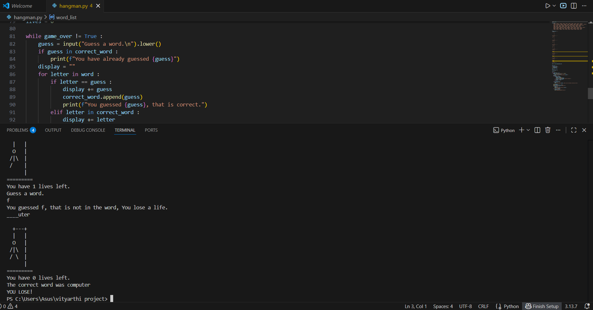

# Hangman Game

A simple command-line Hangman game implemented in Python.   
This project is a beginner-friendly Hangman game where players try to guess a mystery word one letter at a time. Wrong guesses reduce your remaining chances; the goal is to reveal the word before running out of attempts.

---

## Demo


---

## Features
* Random word selection from a preset list  
* User-friendly text interface  
* Tracks guessed and remaining letters  
* Suitable for beginners and learning purposes  

---

## Installation
Clone this repository:
```bash
git clone https://github.com/sejaldixit1311-byte/Hangman-game.git
```
Navigate to the project directory:
```bash
cd Hangman-game
```
Ensure you have Python (3.x) installed on your system.

## Usage
Run the game with:
```bash
python hangman.py
```
Follow on-screen prompts to guess letters and play the game.
